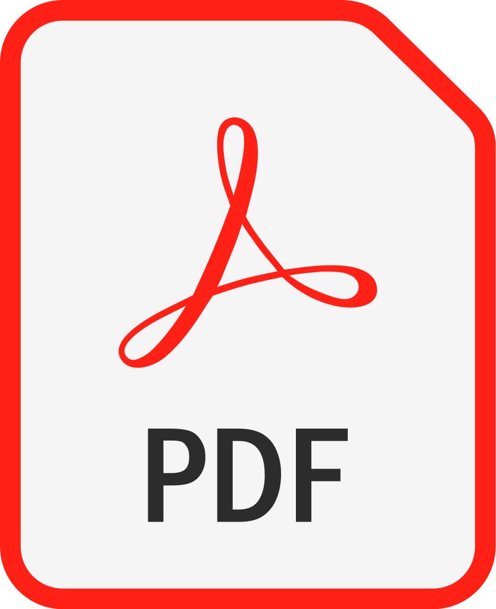

## Explicación del código 
### DDD en .NET 7 con ChatGPT

>  Descargar presentación

> Domain Driven Design Technical (DDD) en .NET 7 con ChatGPT

- 0:00 Presentación 
- 0:50 Funcionamiento del API | POSTAMN
- 2:25 Relación de capas | Arquitectura DDD 
- 3:29 Configurar Mapper | WebAPI
- 6:00 Configurar AppSettings en cualquier capa
- 8:50 Configurar inyección de dependencias entre capas
- 10:53 Capa Application | Arquitectura DDD 
- 16:15 Capa Domain | Arquitectura DDD 
-17:35 (TIPS) ValueObject vs entity | Arquitectura DDD 

😱 MINI SERIE API-CERVECERA 😱 
ChatGPT | Domain Driven Design | .NET 7

🍺 Diseño del negocio guiado con ChatGPT

https://youtu.be/P8aYyvec4v4 

🍺 Como usar ChatGPT para programar un proyecto real

https://youtu.be/8OwTDfZe2Bo

🍺 Código final con arquitectura DDD

https://youtu.be/0CEcZ_Rdrd0

😋 Notas de ayuda 😋

🍺 Instalar Mapper
> dotnet add package AutoMapper --version 12.0.1

🍺 Instalar Options para Configurar AppSettings

> dotnet add package Microsoft.Extensions.Options --version 7.0.1